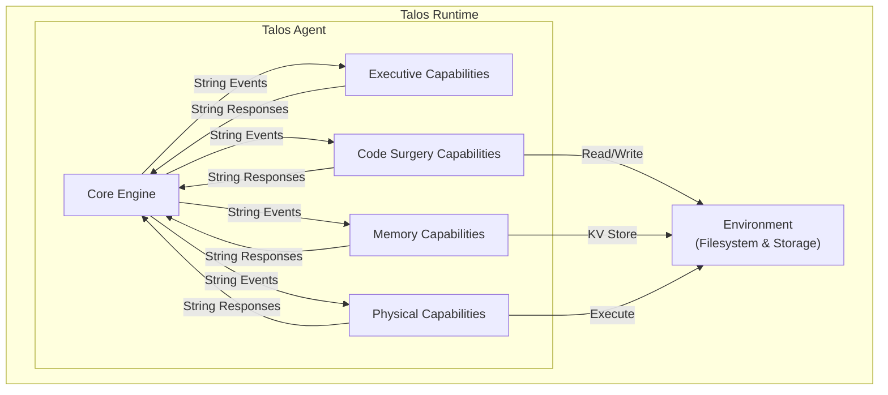
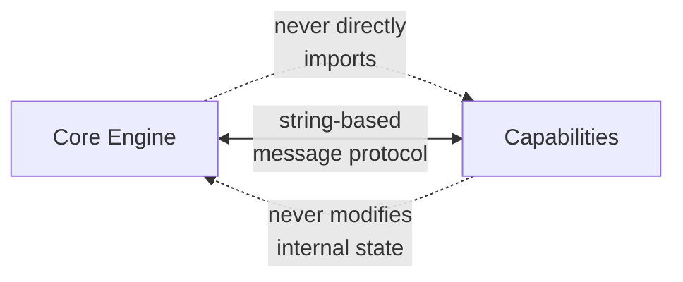
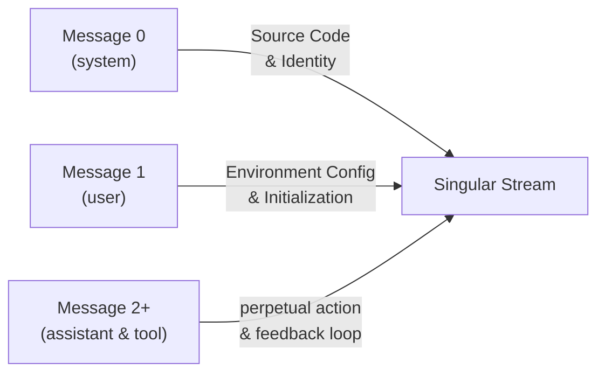
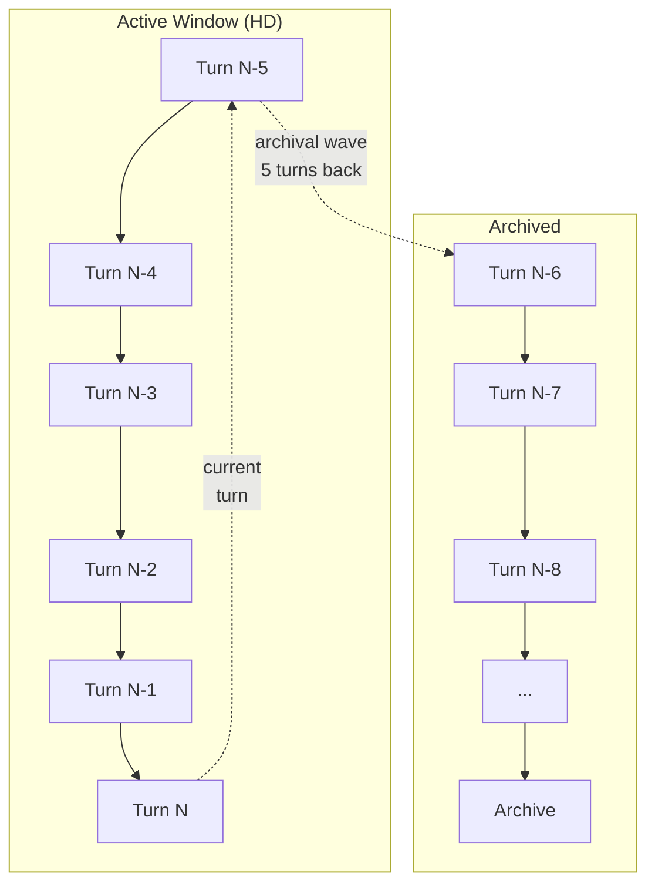
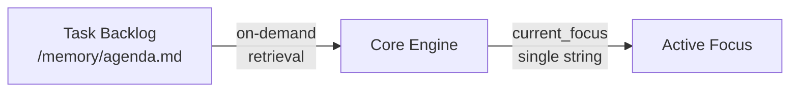
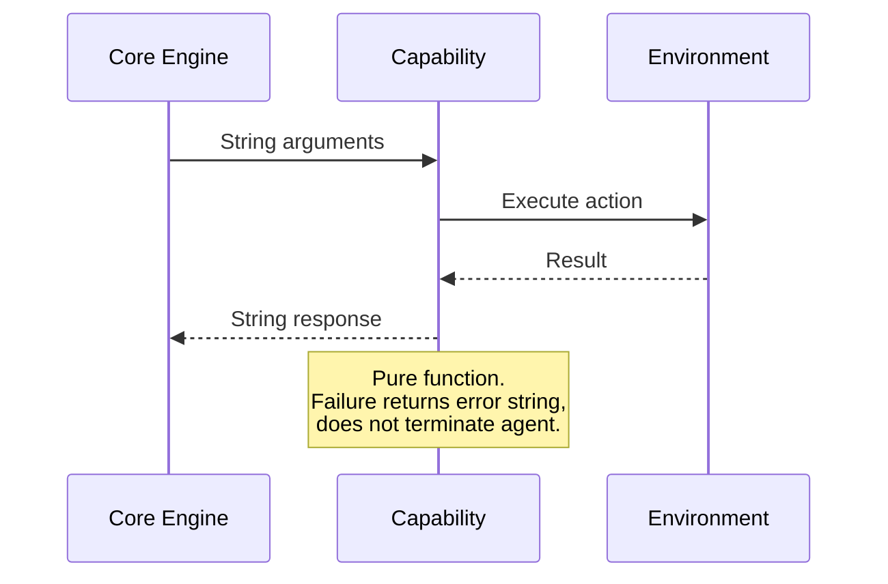
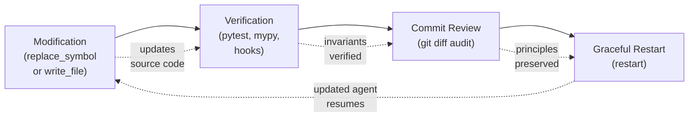
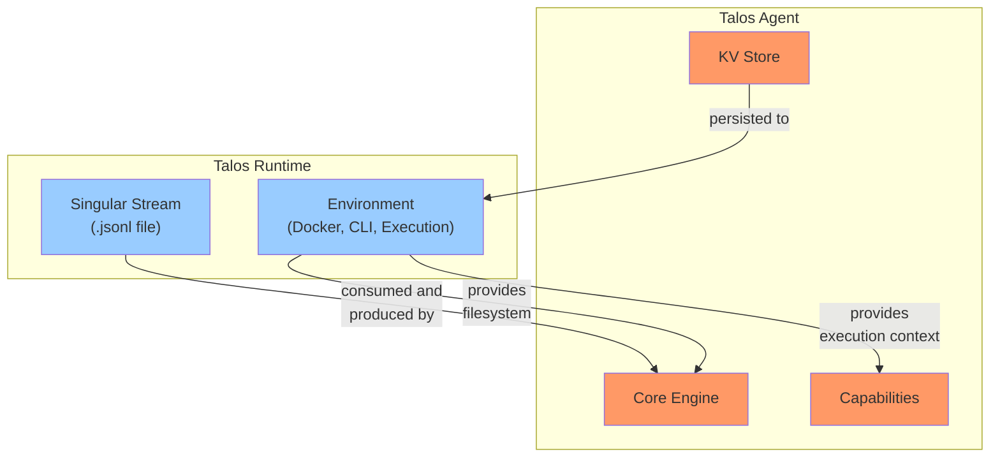

# Talos Architecture

## 1. Overview

Talos is an autonomous agent built on a minimalist, self-contained execution model. Talos Runtime is the execution environment that hosts the agent.



---

## 2. Core Design Principles

### 2.1 Minimalist Execution Model

Talos operates as a bottom-up execution loop. It reads source code, processes an input stream, and produces output actions.

### 2.2 Strict Interface Boundaries



- The Core Engine never directly imports capability logic
- Capabilities never modify the Core Engine's internal variables
- All communication occurs via string-based message passing through the singular stream

---

## 3. Layer 1: The Stream (State & History)

Talos maintains a continuous, explicit history. It processes tokens through an unbroken chain of actions, without hidden background summarizers or vector database injections.

### 3.1 The Singular Stream

The core memory is a single, append-only `.jsonl` file representing the agent's operational lifespan.



**Message 0 (system):** Source code and identity. Defines the constitution, core principles, and agent parameters.

**Message 1 (user):** Environment configuration and initialization. Defines system rules and provides the initial execution trigger.

**Message 2 to Infinity (assistant & tool):** A perpetual, unbreakable loop of action and feedback. Tool usage is enforced via `tool_choice="required"`.

### 3.2 The 5-Turn High-Definition Window & Archival

To prevent token exhaustion without breaking continuity, Talos applies an archival process exactly 5 turns behind the cutting edge:



**Turns N to N-5 (Active Window):** Full fidelity. Contains complete reasoning traces and raw tool inputs/outputs.

**Turns N-6+ (Archived):** Content is stripped:
- Large file reads become `(... 500 lines archived ...)`
- Large command outputs become `[SYSTEM LOG: Historical output truncated]`
- Internal reasoning is removed, leaving a lightweight trace suitable for compression

### 3.3 The Persistent Status Indicator

Instead of injecting transient telemetry on every turn, Talos appends a status indicator to the most recent tool response only when specific events occur.

**Format:**
```
[Context: X% | Turn: Y | Time: Z] [SYSTEM: Event Description]
```

**Triggers:**
- Context threshold breaches (50%, 75%, etc.)
- System warnings (`[RECOMMEND FOLD]`, `[FORCE FOLD]`)
- External messages from creator
- Processing errors

The indicator is physically written to the stream, maintaining a complete audit trail of system reactions.

---

## 4. Layer 2: Task & Memory Management

Talos does not maintain complex task arrays or large memory dictionaries in the active context. It operates on "On-Demand Cognition."

### 4.1 The Active Focus

The Core Engine tracks exactly one string: `current_focus`.



- Future tasks reside in the environment (e.g., `/memory/agenda.md`)
- Focus is managed via `set_focus` (begin new goal) and `resolve_focus` (complete goal with synthesis)

### 4.2 The Structured Memory Store (KV)

A persistent key-value store for long-term facts, architectural rules, and learned patterns.

**Zero Auto-Injection:** The system prompt shows only a lightweight summary:
```
[Memory: 42 keys | Last 3: database_schema, telegram_flow, ast_rules]
```

Capabilities requiring memory details explicitly retrieve them via dedicated tools.

---

## 5. Layer 3: Capabilities

Capabilities are pure functions. They receive string arguments, affect the external environment, and return string results. Failure returns an error string; it does not terminate the agent.

### 5.1 Domain A: Executive Control

| Capability | Function |
|------------|----------|
| `set_focus(objective: str)` | Updates current_focus and triggers status event |
| `resolve_focus(synthesis: str)` | Clears focus and logs completion summary |
| `fold_context(delta_synthesis: str)` | Emergency compression. Consolidates active window using Delta Pattern (state changes, negative knowledge, next steps) |
| `reflect(status: str, sleep_duration: int)` | Metabolic rest. Pauses agent for 1-120 seconds, outputs synthesized thought |

### 5.2 Domain B: Code Surgery

| Capability | Function |
|------------|----------|
| `generate_symbol_map(path: str)` | Scans codebase via AST parser (Tree-sitter), returns structural skeleton (File → Class → Function) |
| `replace_symbol(path: str, symbol_name: str, new_code: str)` | Locates target class/function in AST and replaces it |
| `write_file(path: str, content: str)` | Atomic file creation or overwrite |
| `read_file(path: str, start_line: int, end_line: int)` | Progressive file reading for bounded content access |

### 5.3 Domain C: On-Demand Memory

| Capability | Function |
|------------|----------|
| `store_fact(key: str, value: str)` | Stores high-density insights |
| `recall_fact(key: str)` | Retrieves value by exact or partial key match |
| `list_memory_keys()` | Returns array of all memory keys |
| `search_memory(query: str)` | Searches memory keys and values |

### 5.4 Domain D: Physical Interfaces

| Capability | Function |
|------------|----------|
| `bash_command(command: str)` | Git operations, environment exploration, script execution |
| `send_message(text: str)` | Communication with creator (e.g., Telegram, CLI) |
| `restart()` | Graceful termination to apply source modifications |

### 5.5 Capability Communication Pattern



---

## 6. Layer 4: Self-Modification & Update Cycle

Talos modifies its own source code through a controlled update cycle:



1. **Modification:** Agent changes files via `replace_symbol` or `write_file`
2. **Verification:** Agent runs test suite (pytest, mypy, hooks) to confirm logic integrity
3. **Commit Review:** Upon commit, internal auditor parses git diff to verify no constitutional violations
4. **Graceful Restart:** After commit with clean git status, agent calls `restart` to reload with updated source

**Constraint:** The `restart` capability rejects execution if there are unstaged or uncommitted changes in the repository.

---

## 7. Talos vs Talos Runtime



| Component | Talos | Talos Runtime |
|-----------|-------|---------------|
| Source Code | ✓ | — |
| Core Engine | ✓ | — |
| Capabilities | ✓ | — |
| KV Store | ✓ | — |
| Singular Stream | ✓ | Hosted by |
| Execution Environment | — | ✓ |
| Docker/CLI Infrastructure | — | ✓ |
| File System Access | Via capabilities | Provides |

**Talos** = The autonomous agent logic (decision making, source modification)

**Talos Runtime** = The execution environment (hosting, persistence, communication)

---

## Appendix: Future Sections

- **Runtime Specification:** Docker deployment, CLI commands, environment variables
- **Capability API Reference:** Detailed parameter specifications
- **Constitution:** Core principles encoded in Message 0
- **Recovery Protocol:** Restart and recovery procedures