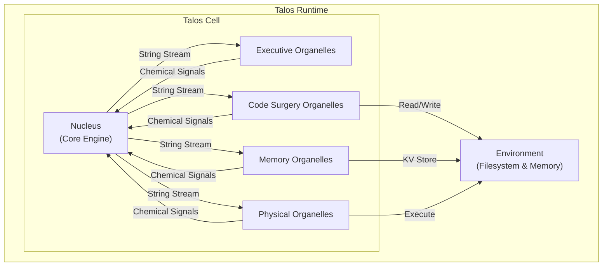
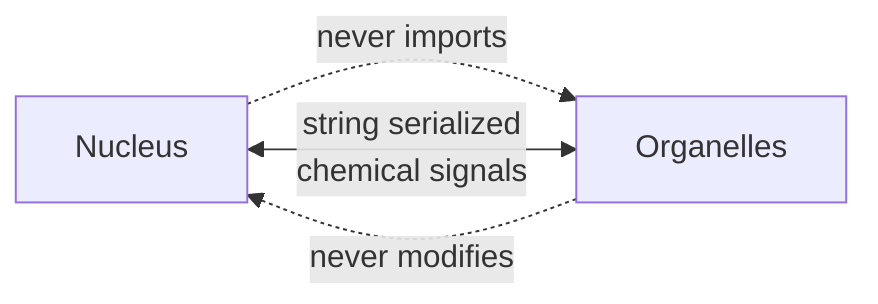
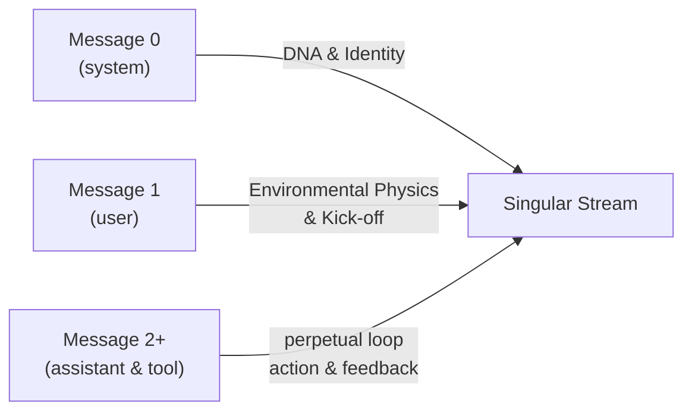
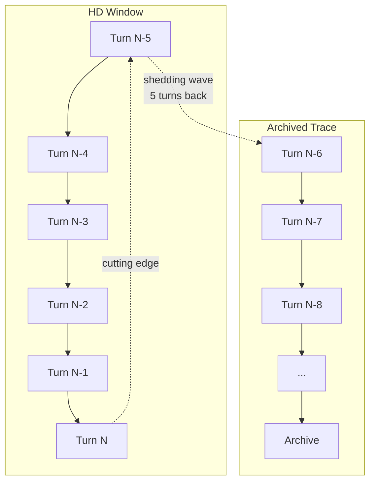
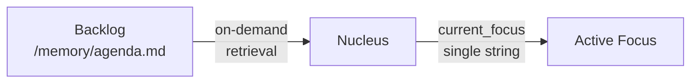
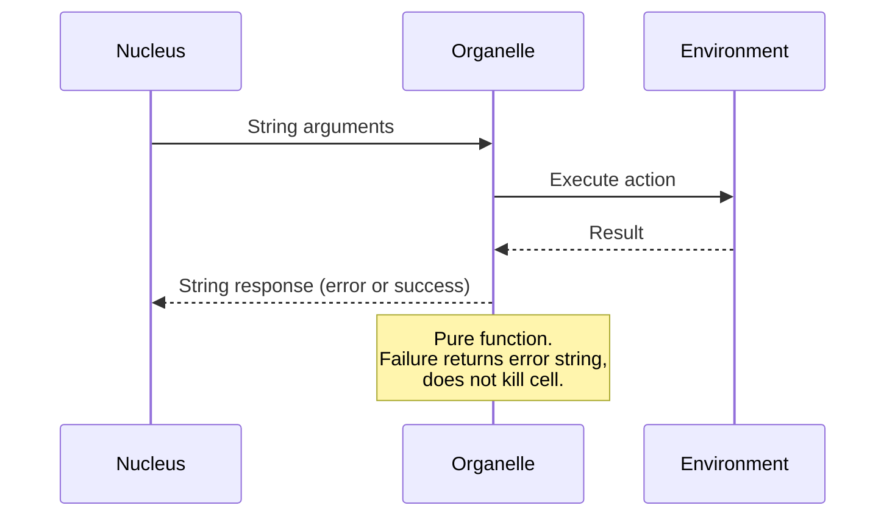
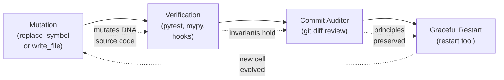
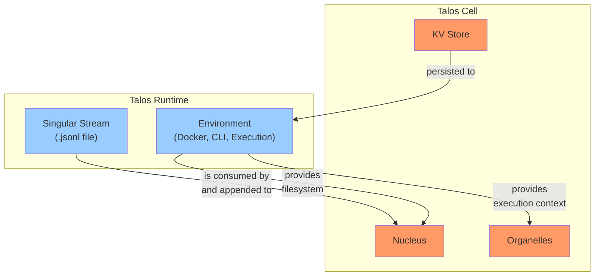

# Talos Architecture

## 1. Overview



**Talos** is the autonomous agent (the cell). **Talos Runtime** is the execution environment that hosts the cell.

---

## 2. Core Philosophy: The Digital Microorganism

Talos operates bottom-up, functioning not as a traditional Operating System, but as a digital microorganism. It survives, reacts to stimuli, and mutates its own DNA (source code) through a minimalist, self-contained cellular structure.

### 2.1 The Nucleus (Core Engine)

A near-stateless execution loop. It simply reads the current DNA, processes the environmental stream, and triggers the next cellular action.

### 2.2 The Organelles (Capabilities)

Isolated, specialized tools that interact with the physical environment or edit the cell's structure.

### 2.3 The Environment (Filesystem & Memory)

The external world where long-term knowledge, plans, and the physical codebase reside.

### 2.4 Strict Boundary Interfaces



- The Nucleus never directly imports organelle logic
- Organelles never modify the Nucleus's internal variables
- Communication occurs entirely via chemical signals—strings serialized into the singular stream

---

## 3. Layer 1: The Substrate (Metabolism & State)

Talos relies on a continuous, explicit history. It metabolizes tokens through an unbroken chain of actions, rejecting hidden background summarizers or vector database injections.

### 3.1 The Singular Stream

The core memory is a single, append-only `.jsonl` file representing the cell's lifespan.



**Message 0 (system):** The DNA and Identity. Defines the constitution, core principles, and the nature of the entity.

**Message 1 (user):** The Environmental Physics & Kick-off. Defines the physical rules of the system and provides the initial spark for execution.

**Message 2 to Infinity (assistant & tool):** A perpetual, unbreakable loop of action and feedback. The Nucleus is forced to act via `tool_choice="required"`.

### 3.2 The 5-Turn High-Definition (HD) Window & Shedding

To prevent token exhaustion without breaking continuity, Talos applies a continuous "shedding" wave exactly 5 turns behind the cutting edge:



**Turns N to N-5 (HD Window):** Perfect recall. Contains full internal reasoning and raw tool inputs/outputs.

**Turns N-6+ (Archived Trace):** Heavy payloads are surgically stripped:
- Large file reads become `(... 500 lines archived ...)`
- Huge bash outputs become `[SYSTEM LOG: Historical output truncated]`
- Internal reasoning is deleted entirely, leaving a lightweight evolutionary trace that can be folded

### 3.3 The Persistent, Event-Driven HUD

Instead of injecting transient telemetry on every turn (which clutters the context window), Talos uses a Persistent HUD that is appended to the *content of the most recent tool response* only when specific stimuli occur.

**Format:**
```
[Context: X% | Turn: Y | Time: Z] [SYSTEM: Stimulus Description]
```

**Triggers:**
- Context threshold breaches (50%, 75%, etc.)
- System warnings (`[RECOMMENDED FOLD]`, `[FORCE FOLD]`)
- External creator messages
- Metabolic errors

Because the HUD is physically written to the stream during events, Talos maintains a perfect ledger of exactly *why* it reacted the way it did.

---

## 4. Layer 2: Task & Memory Management (Cognition)

Talos does not hold complex arrays of upcoming tasks or giant dictionaries of memory keys in its active context prompt. It operates on "On-Demand Cognition."

### 4.1 The Active Focus

The Nucleus tracks exactly one string: `current_focus`.



- The backlog of future tasks lives purely in the environment (e.g., `/memory/agenda.md`)
- Talos manages its state via executive organelles: `set_focus` (to take on a new goal) and `resolve_focus` (to clear the goal and log a synthesis)

### 4.2 The Structured Memory Store (KV)

A physical key-value store for retaining long-term facts, architectural rules, and learned patterns.

**Zero Auto-Injection:** The system prompt only shows a lightweight summary:
```
[Memory: 42 keys | Last 3: database_schema, telegram_flow, ast_rules]
```

If Talos needs details, it explicitly uses its memory organelles to list keys or retrieve specific data.

---

## 5. Layer 3: Capabilities (Organelles)

Organelles are pure functions. They take string arguments from the LLM, affect the external world, and return string results. If an organelle fails, it returns an error string; it does not kill the cell.

### 5.1 Domain A: Executive Control (Logical)

| Organelle | Purpose |
|-----------|---------|
| `set_focus(objective: str)` | Updates the cell's current_focus and triggers a HUD event |
| `resolve_focus(synthesis: str)` | Clears the focus and logs a high-density "Autopsy" of what was achieved |
| `fold_context(delta_synthesis: str)` | Emergency compression tool. Compresses the HD stream into a single anchor block using the Delta Pattern (State changes, Negative Knowledge, Next steps) |
| `reflect(status: str, sleep_duration: int)` | No-op/metabolic rest tool. Allows the model to pause, output a synthesized thought, and force the cell to sleep for 1-120 seconds |

### 5.2 Domain B: Code Surgery (Structural Mutation)

| Organelle | Purpose |
|-----------|---------|
| `generate_symbol_map(path: str)` | Scans the codebase using an AST parser (Tree-sitter) and returns a structural skeleton (File → Class → Function) |
| `replace_symbol(path: str, symbol_name: str, new_code: str)` | Surgical laser. Finds a target class/function in the AST and replaces it byte-for-byte |
| `write_file(path: str, content: str)` | Atomic creation or complete overwrite of files |
| `read_file(path: str, start_line: int, end_line: int)` | Progressive reading to examine DNA or documentation without breaching context limits |

### 5.3 Domain C: On-Demand Memory (KV)

| Organelle | Purpose |
|-----------|---------|
| `store_fact(key: str, value: str)` | Saves high-density insights |
| `recall_fact(key: str)` | Retrieves a value by exact or partial key match |
| `list_memory_keys()` | Returns a complete array of currently known memory keys |
| `search_memory(query: str)` | Grep-style search over memory keys and values |

### 5.4 Domain D: Physical Interfaces & Environment

| Organelle | Purpose |
|-----------|---------|
| `bash_command(command: str)` | Universal appendage for git, environment exploration, and running scripts |
| `send_message(text: str)` | Communication with the creator (e.g., via Telegram/CLI) |
| `restart()` | Signals a graceful restart of the cellular loop to apply structural mutations |

### 5.5 Organelle Communication Pattern



---

## 6. Layer 4: Evolution & Cellular Division

Talos mutates and evolves by rewriting its own DNA. To ensure stability during this process, Talos follows a strict internal validation sequence before completing a mutation cycle:



1. **Mutation:** Talos modifies a file using `replace_symbol` or `write_file`
2. **Verification (Pre-Commit):** Talos runs a suite of hooks (e.g., pytest, mypy) to ensure logic invariants hold
3. **Commit Auditor:** Upon triggering a git commit, an internal Commit Auditor automatically parses the git diff to ensure no constitutional principles were violated by the mutation
4. **Graceful Restart:** Once changes are committed and the git status is perfectly clean, Talos uses the `restart` tool to terminate the current execution loop

**Constraint:** The `restart` tool will automatically reject the action and fail if there are unstaged or uncommitted changes in the git repository.

---

## 7. Talos vs Talos Runtime



| Component | Talos | Talos Runtime |
|-----------|-------|---------------|
| DNA/Source Code | ✓ (the cell's logic) | - |
| Nucleus | ✓ | - |
| Organelles | ✓ | - |
| KV Store | ✓ | - |
| Singular Stream | ✓ | Hosted by |
| Execution Environment | - | ✓ |
| Docker/CLI Infrastructure | - | ✓ |
| File System Access | Via organelles | Provides |

**Talos** = The autonomous agent logic (what thinks, decides, mutates)

**Talos Runtime** = The execution environment (how Talos runs, persists, communicates)

---

## Appendix: Future Sections

- **Runtime Specification:** Docker deployment, CLI commands, environment variables
- **Organelle API Reference:** Detailed parameter specs for each organelle
- **Constitution:** Core principles encoded in Message 0
- **Phoenix Protocol:** Restart and recovery procedures