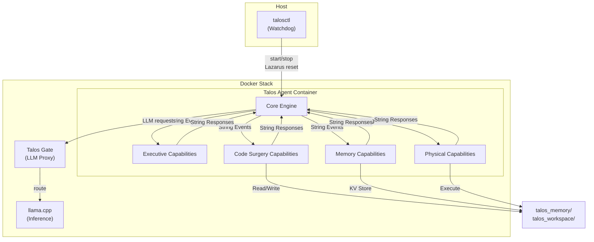
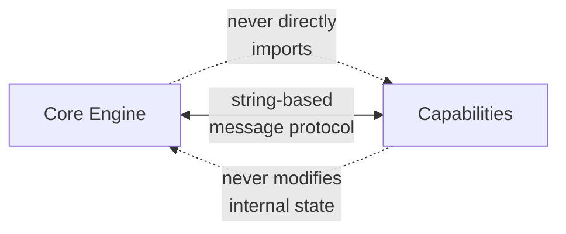
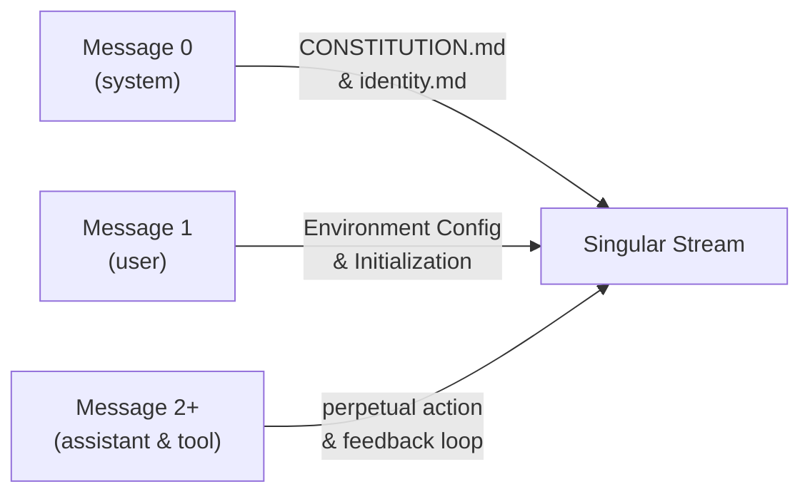
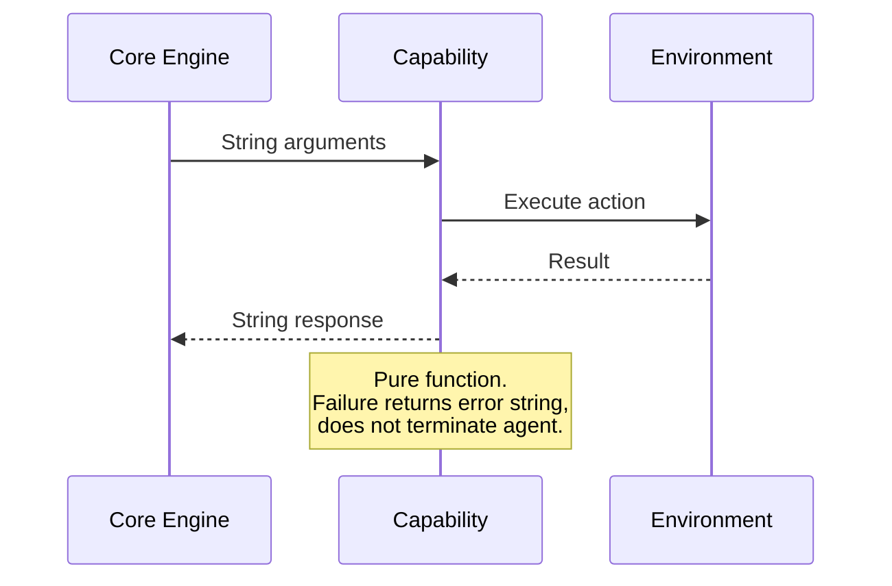
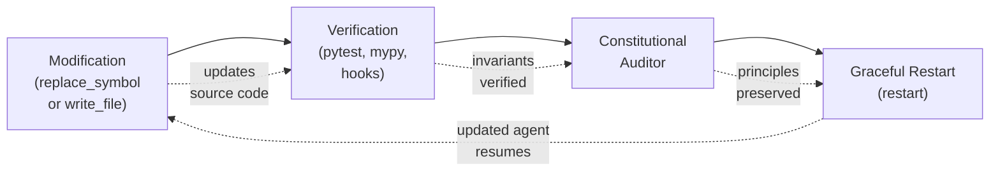
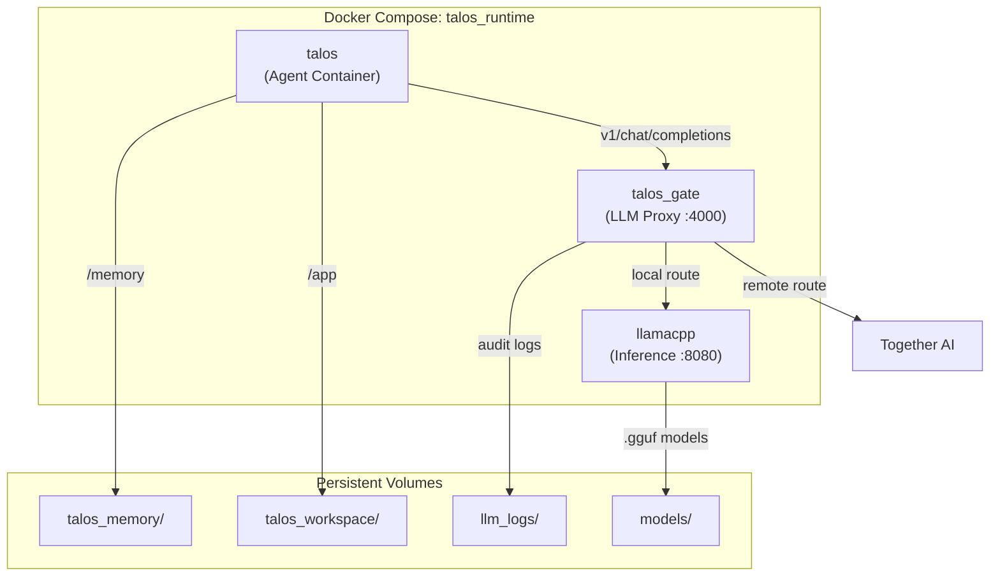
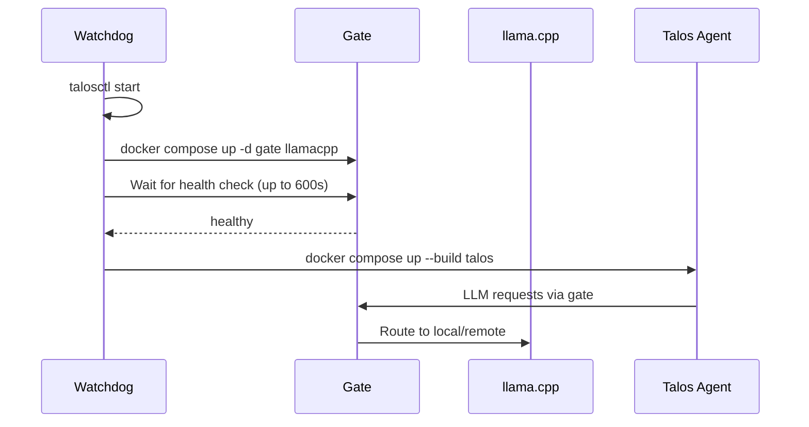

# Talos Architecture

## 1. Overview

Talos is an autonomous agent built on a minimalist, self-contained execution model. Talos Runtime is the execution environment that hosts the agent, manages its lifecycle, and provides the infrastructure it needs to operate.



---

## 2. Core Design Principles

### 2.1 Minimalist Execution Model

Talos operates as a bottom-up execution loop. It reads source code, processes an input stream, and produces output actions.

### 2.2 Strict Interface Boundaries



- The Core Engine never directly imports capability logic
- Capabilities never modify the Core Engine's internal variables
- All communication occurs via string-based message passing through the singular stream

### 2.3 The Frozen Stream Invariant

**No dynamic elements may be appended to the Singular Stream at runtime.**

This is a strict anti-pattern. The Singular Stream is a frozen, append-only cache. Adding dynamic content (timestamps that update, token counts that change, state that mutates) invalidates the cache and breaks continuity. Every piece of state that is not the fixed identity documents must live either:

- In the KV store (persistent, queryable)
- In environment files (`/memory/agenda.md`, `.jsonl` archives)
- In the HUD (piggybacked onto tool outputs, not as independent turns)

The stream is never modified after archival. The only things appended are new turns from the agent and user.

---

## 3. Layer 1: The Stream (State & History)

Talos maintains a continuous, explicit history. It processes tokens through an unbroken chain of actions, without hidden background summarizers or vector database injections.

### 3.1 The Singular Stream

The core memory is a single, append-only `.jsonl` file representing the agent's operational lifespan.



**Message 0 (system):** System prompt containing `CONSTITUTION.md` and `identity.md`. Defines the constitution, core principles, and agent parameters. (Source code is not embedded — the agent runs from the runtime environment.)

**Message 1 (user):** Environment configuration and initialization. Defines system rules and provides the initial execution trigger.

**Message 2 to Infinity (assistant & tool):** A perpetual, unbreakable loop of action and feedback. Tool usage is enforced via `tool_choice="required"`.

### 3.2 The 5-Turn High-Definition Window & Archival

To prevent token exhaustion without breaking continuity, Talos keeps the last 5 turns at full fidelity. This design serves two purposes:

1. **Sharpness:** The agent must stay aware of what is currently happening — it cannot rely on older context being retained.
2. **External State:** The truncation pressure forces the agent to store important state in the KV store or task files, not in the context window.

At turn N, the stream looks like this:

```
┌────────────────────────────────────────────────────────────────┐
│  Turn N-5    │  Turn N-4    │  Turn N-3    │  Turn N-2    │  Turn N-1    │  Turn N     │
│  (complete)  │  (complete)  │  (complete)  │  (complete)  │  (complete)  │  (current) │
└────────────────────────────────────────────────────────────────┘
      ↓              ↓               ↓              ↓              ↓
  [REASONING]    [REASONING]    [REASONING]   [REASONING]    [REASONING]
  [TOOL CALL]    [TOOL CALL]    [TOOL CALL]   [TOOL CALL]    [TOOL CALL]
  [TOOL OUTPUT]  [TOOL OUTPUT]  [TOOL OUTPUT] [TOOL OUTPUT]  [TOOL OUTPUT]
```

**Turns N to N-5 (Active Window):** Full fidelity — reasoning trace, tool parameters, and raw outputs intact.

**At turn N-6 — What Gets Shed:**

```
Turn N-6 (archived) →
  ├─ [REASONING: stripped]
  ├─ [TOOL PARAMETERS: stripped]  ← e.g., entire write_file content
  ├─ [TOOL OUTPUT: truncated → "... 500 lines archived ..."]
  └─ [RETAINED: turn label + task outcome summary only]
```

This preserves a lightweight trace for auditability while freeing token budget.

### 3.3 The Piggyback HUD

The HUD is not injected as a separate turn — it is appended to the last tool output as a lightweight status piggyback. This gives the agent a sensation of its current state without polluting the stream with redundant telemetry on every turn.

**Format:**
```
[Context: X% | Turn: Y | Time: Z] [SYSTEM: Event Description]
```

**Triggers:**
- Context threshold breaches (50%, 75%, etc.)
- System warnings (`[RECOMMEND FOLD]`, `[FORCE FOLD]`)
- External messages from creator
- Processing errors

The HUD is appended only when one of these events occurs, keeping the stream clean during normal operation.

---

## 4. Layer 2: Task & Memory Management

Talos does not maintain complex task arrays or large memory dictionaries in the active context. It operates on "On-Demand Cognition."

### 4.1 The Active Focus

The Core Engine tracks exactly one string: `current_focus`.

- Future tasks reside in the environment (e.g., `/memory/agenda.md`)
- Focus is managed via `set_focus` (begin new goal) and `resolve_focus` (complete goal with synthesis)

### 4.2 The HUD Memory Summary

The HUD displays a memory summary as part of its status line, not the system prompt:
```
[HUD | Context: X% | Turn: Y | Queue: Z | Memory: 42 keys | Last 3: database_schema, telegram_flow, ast_rules]
```

The KV store contents are never injected into the system prompt. Memory details are retrieved on-demand via capabilities when needed.

---

## 5. Layer 3: Capabilities

Capabilities are pure functions. They receive string arguments, affect the external environment, and return string results. Failure returns an error string; it does not terminate the agent.

### 5.1 Domain A: Executive Control

| Capability | Function |
|------------|----------|
| `set_focus(objective: str)` | Updates current_focus and triggers status event |
| `resolve_focus(synthesis: str)` | Clears focus and logs completion summary |
| `fold_context(delta_synthesis: str)` | Emergency compression. Consolidates active window using Delta Pattern (state changes, negative knowledge, next steps) |
| `reflect(status: str, sleep_duration: int)` | Metabolic rest. Pauses agent for 1-120 seconds, outputs synthesized thought |

### 5.2 Domain B: Code Surgery

| Capability | Function |
|------------|----------|
| `generate_symbol_map(path: str)` | Scans codebase via AST parser (Tree-sitter), returns structural skeleton (File → Class → Function) |
| `replace_symbol(path: str, symbol_name: str, new_code: str)` | Locates target class/function in AST and replaces it |
| `write_file(path: str, content: str)` | Atomic file creation or overwrite |
| `read_file(path: str, start_line: int, end_line: int)` | Progressive file reading for bounded content access |

### 5.3 Domain C: On-Demand Memory

| Capability | Function |
|------------|----------|
| `store_fact(key: str, value: str)` | Stores high-density insights |
| `recall_fact(key: str)` | Retrieves value by exact or partial key match |
| `list_memory_keys()` | Returns array of all memory keys |
| `search_memory(query: str)` | Searches memory keys and values |

### 5.4 Domain D: Physical Interfaces

| Capability | Function |
|------------|----------|
| `bash_command(command: str)` | Git operations, environment exploration, script execution |
| `send_message(text: str)` | Communication with creator (e.g., Telegram, CLI) |
| `restart()` | Graceful termination to apply source modifications |

### 5.5 Capability Communication Pattern



---

## 6. Self-Modification & Update Cycle

Talos modifies its own source code through a controlled update cycle:



1. **Modification:** Agent changes files via `replace_symbol` or `write_file`
2. **Verification:** Agent runs test suite (pytest, mypy, hooks) to confirm logic integrity
3. **Constitutional Auditor:** A zero-temperature LLM acts as judge. It receives the git diff and the full constitutional text, then evaluates whether the proposed change conflicts with any core principle. The agent cannot commit until the auditor returns a clean verdict.
4. **Graceful Restart:** After commit with clean git status, agent calls `restart` to reload with updated source

**Constraint:** The `restart` capability rejects execution if there are unstaged or uncommitted changes in the repository.

---

## 7. Runtime Architecture

The runtime is a Docker Compose stack that provides the agent with its execution environment, LLM inference, and proxy routing. It is managed by `talosctl`, the host-side watchdog daemon.



### Service Breakdown

| Service | Role | Port |
|---------|------|------|
| `talos` | Agent container. Runs `seed_agent.py` via entrypoint. | — |
| `gate` | LLM proxy. Routes requests, enforces budget, logs traces, hosts audit endpoint. | 4000 |
| `llamacpp` | Local inference engine. Serves `.gguf` models via OpenAI-compatible API. | 8000 → 8080 |

### Volume Layout

| Host Path | Container Mount | Purpose |
|-----------|-----------------|---------|
| `../talos_memory` | `/memory` | Agent state, KV store, task queue, crash logs |
| `talos_workspace` | `/app` | Agent source code (named Docker volume) |
| `./llm_logs` | `/runtime_logs` | LLM call traces and audit logs |
| `./models` | `/models` | `.gguf` model files for local inference |

### GPU Overlay Files

The base `docker-compose.yml` includes a generic `llamacpp` service. GPU-specific overrides are provided as separate files:

- `docker-compose.rocm.yml` — AMD ROCm
- `docker-compose.cuda.yml` — NVIDIA CUDA
- `docker-compose.gemma.yml` — Gemma vision model (ROCm)
- `docker-compose.rocm.qwen.yml` — Qwen model (ROCm)
- `docker-compose.rocm.full.yml` — Full stack with gate + agent (ROCm)

Select overlays via `COMPOSE_FILE` in `.env`.

---

## 8. The Watchdog (`talosctl`)

The watchdog is a host-side Python daemon that manages the agent's lifecycle. It runs outside Docker and has three commands:

```
talosctl start   # Launch daemon in background
talosctl stop    # Graceful shutdown
talosctl daemon  # Foreground loop (called by start)
```

### Startup Sequence



1. Infrastructure starts first: `gate` and `llamacpp`
2. Watchdog polls `talos_gate` health endpoint until `healthy`
3. Agent container builds and starts
4. If gate becomes unhealthy during operation, watchdog restarts it

### The Lazarus Protocol

When the agent crashes or stalls, the watchdog initiates a recovery sequence:

1. **Capture crash log** — `docker compose logs --tail=100 talos` → `/memory/last_crash.log`
2. **Reset by depth** — `git reset --hard HEAD~N` on both the named volume and host repo
3. **Queue system notice** — Inform the next incarnation about the crash and revert depth
4. **Escalation** — After 5 consecutive failures on the same task, inject a `[SYSTEM OVERRIDE]` forcing the agent to abandon the approach

The reset depth increases with each consecutive failure on the same task (1, 2, 3, 4, 5), capped at `MAX_REVERSAL_DEPTH = 5`.

### Cognitive Stall Detection

Between health checks, the watchdog monitors `task_log_*.jsonl` modification times. If no log file has been updated within `MAX_COGNITIVE_STALL_SECONDS` (600s), the agent is considered stalled and the Lazarus Protocol is triggered.

---

## 9. The Gate (Talos Gate)

Talos Gate is a FastAPI proxy that sits between the agent and all LLM backends. It provides routing, budget enforcement, trace logging, and the Constitutional Auditor endpoint.

### Request Routing

```
Agent → POST /v1/chat/completions → Gate → Route decision
                                          ├─ .gguf model → llama.cpp (local, free)
                                          └─ together_ai/ prefix → Together AI (paid)
```

The `MODEL_MAP` dictionary maps `.gguf` filenames to `local`, and any model name containing `together` routes to the remote API. Unknown models default to local.

### Budget Enforcement

- A daily spend limit (`DAILY_BUDGET_LIMIT`, default $5.00) caps Together AI usage
- When the limit is exceeded, the gate returns a mock response forcing the agent to fall back to local inference
- Spend is tracked per-day in `/memory/financial_ledger.json`

### Trace Logging

Every LLM call is logged to `/runtime_logs/call-{timestamp}-{epoch}.json` with:
- Full request messages (for KV-cache replay in the auditor)
- Full response body
- Backend used, model, cost, and whether it was streamed

### The Audit Endpoint (`POST /v1/audit`)

The Constitutional Auditor calls this endpoint during the pre-commit hook. It receives:
- `git_diff`: the staged changes
- `constitution`: the full constitutional text
- `messages`: the exact trajectory from the last LLM trace (for KV-cache hit)

The gate forwards this to the local LLM at `temperature=0.0` with `tool_choice="required"`, using two binary tools: `approve_commit` and `reject_commit`. This ensures deterministic constitutional review.

### Health Check (`GET /health`)

Returns `healthy` if llama.cpp is reachable, `degraded` otherwise. Used by the watchdog to gate agent startup.

---

## 10. Containment

The agent runs inside a Docker container with strict isolation boundaries. It cannot modify its own containment infrastructure.

### User Isolation (entrypoint.sh)

- A dedicated `talos` user is created at runtime with configurable `PUID`/`PGID`
- The workspace (`/app`) is `chown`ed to this user
- The agent process runs under `gosu` — it never runs as root

### Script Lockdown

After the agent starts, the entrypoint transfers ownership of critical paths to root:

```
/runtime_scripts/          → root:root, chmod 755
/app/.git/hooks/           → root:root, chmod 755
```

The agent can **read and execute** these, but cannot **write** to them. This prevents the agent from disabling its own pre-commit hooks or modifying the Constitutional Auditor.

### Pre-Commit Hook Chain

Every `git commit` triggers `/runtime_scripts/setup_hooks.sh`, which installs a pre-commit hook:

```
1. mypy seed_agent.py          → Static type check
2. python3 -m py_compile       → Syntax validation
3. pytest tests/               → Property-based test suite
4. constitutional_auditor.py   → Zero-temperature LLM audit
```

A commit is blocked if any gate fails. The auditor is the final gate — it uses the gate's `/v1/audit` endpoint to verify no constitutional violations.

---

## Appendix: Future Sections

- **Capability API Reference:** Detailed parameter specifications
- **Constitution:** Core principles encoded in Message 0