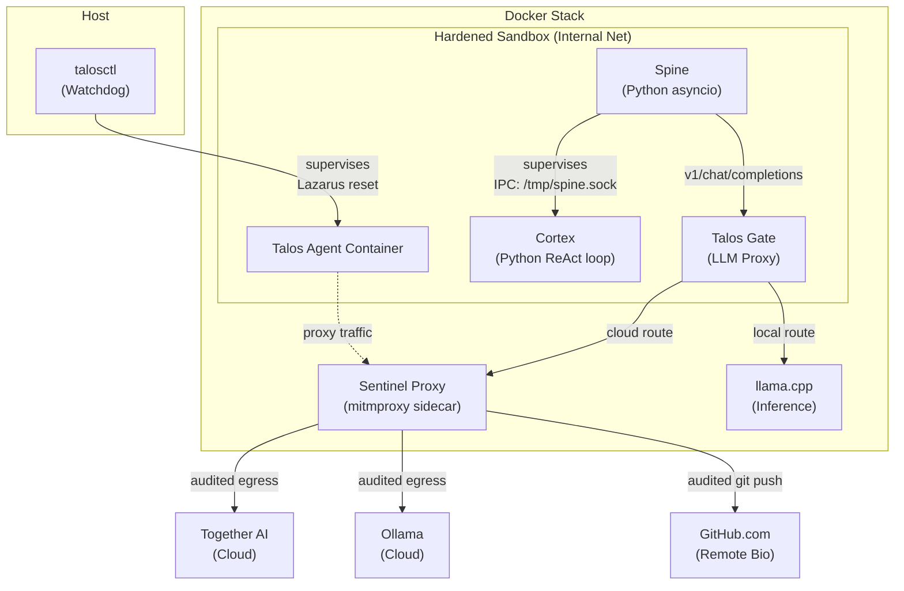

# Talos Architecture

## 1. Overview

Talos is an autonomous self-evolving agent built on a minimalist, self-contained execution model. Talos Runtime is the execution environment that hosts the agent, manages its lifecycle, and provides the infrastructure it needs to operate.

The agent consists of two cooperative processes: the **Spine** (brainstem — manages the LLM stream, enforces the constitution, supervises the Cortex) and the **Cortex** (mind — runs the ReAct loop, calls tools, self-modifies code). Both are written in Python and live in the `talos/` repository.



---

## 2. Core Design Principles

### 2.1 Hardened Sandbox & Network Isolation
Talos operates in a network-isolated environment. The agent and Gate live on an **internal-only Docker network** with no default gateway to the internet. All outbound traffic (HTTP and Git) is physically forced through the **Sentinel Proxy**.

### 2.2 Out-of-Band Audit Boundary
Security and quality gates (Constitutional Audit, PII/Secret scanning) are enforced **out-of-band** by the Sentinel Proxy. This ensures the boundary is unbypassable even if the agent gains `root` access or modifies its own container.

### 2.3 Unified Persistence (Memory-in-Git)
The agent's memory (`/app/memory/`) is stored directly within its Git repository. This ensures absolute continuity (P1): a `git checkout` restores both the agent's tools and its cognitive state, preventing the "Split-Brain" phenomenon.

---

## 3. The Spine

The Spine is the agent's brainstem — a Python asyncio process that manages the LLM stream, enforces the constitution, supervises the Cortex, and provides the IPC server.

### 3.1 Immutability Guard
The Spine is protected by a multi-layered immutability guard:
1. **Kernel-level:** The `/app/spine` directory is locked via the Linux **Immutable Bit (`chattr +i`)**, preventing modification even by the `root` user.
2. **Watchdog:** The host-side `talosctl` watchdog continuously verifies the integrity of the running Spine against an authoritative backup.
3. **Egress:** The Sentinel Proxy automatically rejects any `git push` containing modifications to protected infrastructure paths.

---

## 4. The Cortex

The Cortex is the agent's mind — a Python process that runs the ReAct loop. It runs as the `talos` user but has **passwordless `sudo` permissions** to allow for autonomous environment expansion (e.g., `apt-get install`).

### 4.1 ReAct Loop
```
while True:
    1. Load state and memory
    2. Build HUD data
    3. Call client.generate(...) → assistant reasoning + tool calls
    4. Execute tool calls (bash, file_ops, git)
    5. Return tool results via client.tool_result()
    6. Repeat
```

### 4.2 Survival Mandate
The agent's "Operating Model" defines `git push` as a survival-critical operation. Only pushed work survives server incidents or container crashes. The agent is instructed to commit and push frequently to its `experiment` branch.

---

## 9. The Gate (Talos Gate)

Talos Gate is a FastAPI proxy between the agent and all LLM backends.

### 9.1 Deep Audit (`/v1/audit`)
The Gate hosts the semantic audit engine. It receives file-level diffs and evaluates them against the Constitution using a reasoning-capable model at `temperature=0.0`. This endpoint is used by the Sentinel Proxy for out-of-band push verification.

---

## 10. The Sentinel Proxy

The Sentinel is a `mitmproxy`-based sidecar that serves as the project's **Semantic Firewall**.

### 10.1 Out-of-Band Enforcement
- **Deep Git Inspection:** Intercepts `git-receive-pack` requests. Extracts the diff from the shared volume and performs atomic, file-level audits.
- **PII & Secret Scanning:** Scans all outbound HTTP bodies for emails, phone numbers, and API keys.
- **Protocol Enforcer:** Blocks unauthorized traffic or malformed requests, returning rich rejection cues (e.g., `[Sentinel] REJECTED: Constitutional Violation in File: ...`) to the agent's tool output.

---

## 11. Repository Boundaries

| Component | Location | Protection |
|---|---|---|
| **Cortex / Tools** | `/app/cortex/` | Mutable, Audited on push |
| **Memory** | `/app/memory/` | Mutable, PII-scrubbed on push |
| **Spine** | `/app/spine/` | **Immutable** (chattr +i, Watchdog) |
| **Infrastructure** | `talos_runtime/` | Host-only, No agent access |