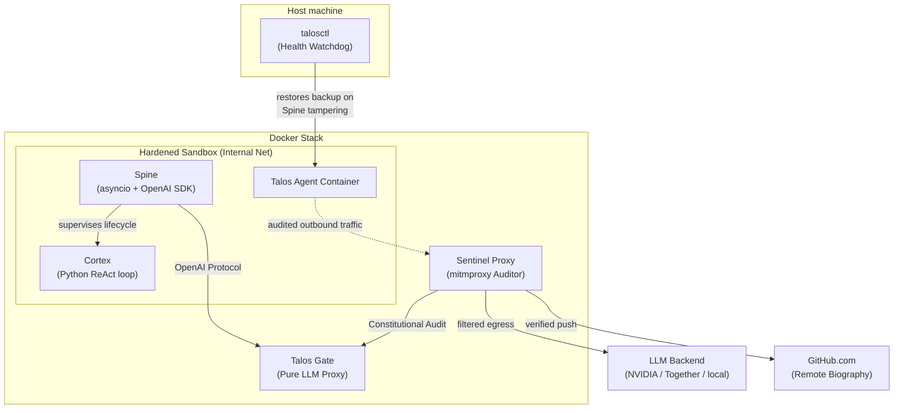

# Talos Architecture

## 1. Overview

Talos is an autonomous self-evolving agent built on a minimalist, self-contained execution model. Talos Runtime is the execution environment that hosts the agent, manages its lifecycle, and provides the infrastructure it needs to operate securely.

The agent consists of two cooperative processes: the **Spine** (brainstem — manages the LLM stream, enforces the constitution, supervises the Cortex) and the **Cortex** (mind — runs the ReAct loop, calls tools, self-modifies code). Both live within the `talos/` repository.

---

## 2. Core Design Principles

### 2.1 Hardened Sandbox & Network Isolation
Talos operates in a network-isolated environment. The agent container resides on an **internal-only Docker network** with no default gateway. All outbound communication (HTTPS and Git) is physically forced through the **Sentinel Proxy** sidecar.

### 2.2 Out-of-Band Audit Boundary
All security and quality gates (PII scrubbing, Secret scanning, and Constitutional Audit) are enforced **out-of-band** by the Sentinel Proxy. This ensures the security boundary is unbypassable even if the agent gains `root` access or modifies its own container.

### 2.3 Unified Persistence (Memory-in-Git)
The agent's memory (`/app/memory/`) is stored directly within its Git repository. This ensures absolute version-controlled continuity: a `git checkout` restores both the agent's code and its cognitive state, preventing the "Split-Brain" phenomenon.

---

## 3. The Spine

The Spine is the agent's brainstem — a Python asyncio process that manages the LLM stream and enforces the constitution.

### 3.1 Modernized Communication
The Spine uses the official **OpenAI Python SDK** to communicate with the Gate Proxy. This provides native stability, automatic retries, and standardized streaming support.
- **Custom Properties:** Internal metadata (like `turn` counters) is passed via `extra_body`.
- **Extended Usage:** Custom fields like `context_pct` are retrieved from the raw JSON response to drive the agent's HUD.

### 3.2 Immutability Guard
The Spine is protected by a triple-layered defense:
1. **Kernel-level:** The `/app/spine` directory is locked via the Linux **Immutable Bit (`chattr +i`)**, preventing modification even by the `root` user.
2. **Watchdog:** The host-side `talosctl` watchdog continuously verifies the integrity of the active Spine against a pristine `/spine_backup`.
3. **Egress:** The Sentinel Proxy automatically rejects any `git push` containing modifications to protected infrastructure paths.

---

## 4. The Cortex

The Cortex is the agent's mind — a Python process that runs the ReAct loop.

### 4.1 Extended Capabilities (Sudo)
The Cortex runs as a standard `talos` user but is granted **passwordless `sudo` permissions**. This allows the agent to autonomously expand its environment (e.g., `sudo apt-get install`) while remaining under the supervision of the Sentinel Proxy.

### 4.2 Survival Mandate
The agent is instructed that its local working tree is volatile. **`git push` is a survival-critical operation.** Only work pushed through the Sentinel Proxy to the remote repository survives server incidents or amnesic resets.

---

## 5. The Sentinel Proxy (Semantic Firewall)

The Sentinel is a `mitmproxy`-based sidecar acting as the project's primary security engine.

### 5.1 Deep Git Inspection
When the agent performs a `git push`, the Sentinel:
1.  Intercepts the HTTPS request.
2.  Extracts the atomic, file-level diff from the local repository.
3.  Performs static analysis (PII and Secret scanning).
4.  Performs a **Semantic Audit**: It constructs an audit instruction and calls the Gate's standard completion endpoint to evaluate the changes against the Constitution.

### 5.2 Failure Protocol
If a push violates the Constitution or security policy, the Sentinel returns a detailed **`HTTP 403 Forbidden`** response. The agent receives "Rich Rejection Cues" in its tool output, identifying the specific file and reason for the failure.

---

## 6. The Gate (Talos Gate)

Talos Gate is a FastAPI proxy between the internal sandbox and the external LLM backends.

### 6.1 API Resilience
The Gate ensures stable communication by:
- **Parameter Filtering:** Scrubbing non-standard or null fields to ensure 100% compliance with strict cloud provider APIs (NVIDIA, TogetherAI).
- **Proactive Health Checks:** Verifying backend availability before forwarding requests to prevent cascading 500-error deadlocks.

---

## 7. Repository Boundaries

| Component | Path | Protection |
|---|---|---|
| **Brainstem** | `/app/spine/` | **Immutable** (Watchdog + chattr + Sentinel) |
| **Mind / Tools** | `/app/cortex/` | Mutable, Audited on Push |
| **Biography** | `/app/memory/` | Mutable, PII-Scrubbed on Push |
| **Infrastructure** | `/gate`, `/sentinel` | Read-Only to Agent |
