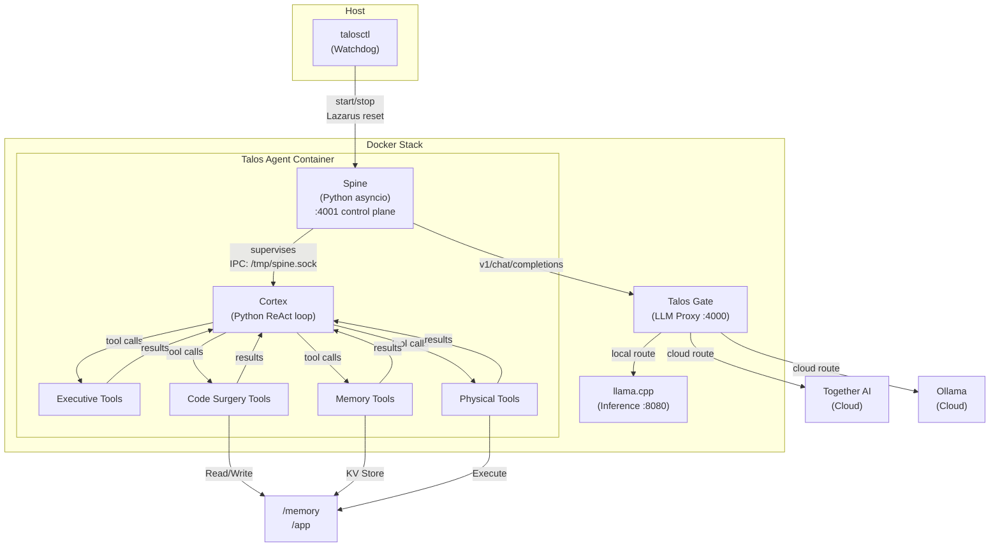
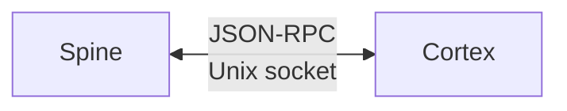
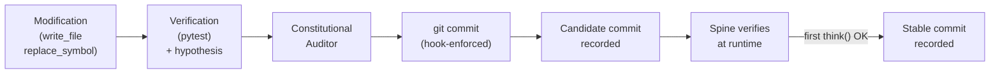
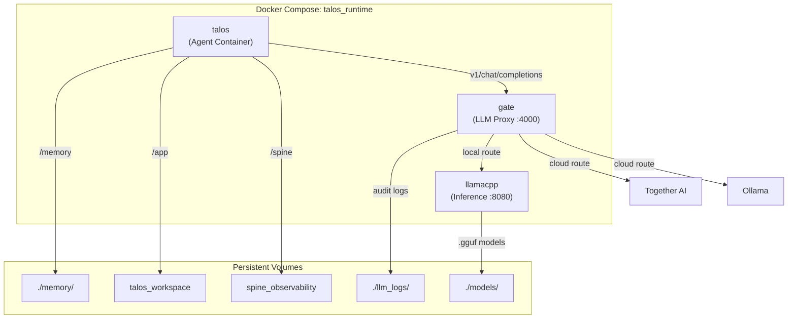

# Talos Architecture

## 1. Overview

Talos is an autonomous self-evolving agent built on a minimalist, self-contained execution model. Talos Runtime is the execution environment that hosts the agent, manages its lifecycle, and provides the infrastructure it needs to operate.

The agent consists of two cooperative processes: the **Spine** (brainstem — manages the LLM stream, enforces the constitution, supervises the Cortex) and the **Cortex** (mind — runs the ReAct loop, calls tools, self-modifies code). Both are written in Python and live in the `talos/` repository.



---

## 2. Core Design Principles

### 2.1 Minimalist Execution Model

Talos operates as a bottom-up execution loop. It reads source code, processes an input stream, and produces output actions.

### 2.2 Strict Interface Boundaries

The Spine and Cortex communicate exclusively through a JSON-RPC protocol over Unix domain socket. The Cortex never imports Spine internals; the Spine never imports Cortex internals.



- The Spine manages the LLM stream, enforces the constitution, and supervises the Cortex process
- The Cortex executes the ReAct loop, calls tools, and self-modifies code
- All communication occurs via the 7 JSON-RPC methods (think, tool_result, request_fold, request_restart, send_message, emit_event, get_state)

### 2.3 The Frozen Stream Invariant

**No dynamic elements may be injected into the frozen prefix of the stream at runtime.**

The system prompt (Message 0) and initialization (Message 1) form a frozen prefix that must never change between requests. This is what enables KV-cache reuse — changing the prefix invalidates the cache and forces the model to re-process every token from scratch.

Dynamic data (HUD, context percentage, turn number) is piggybacked onto the last user message, never injected as a new system message or mutated into the prefix. This is P10 (Stream Integrity) of the Constitution.

The stream is never modified after archival. The only things appended are new turns from the agent and user.

---

## 3. The Spine

The Spine is the agent's brainstem — a Python asyncio process that manages the LLM stream, enforces the constitution, supervises the Cortex, and provides the IPC server. It runs as root inside the Talos container.

### 3.1 Module Structure

```
talos/spine/
  main.py               ← asyncio entry point, starts all subsystems
  config.py             ← Load spine_config.json, SpineConfig dataclass
  ipc_server.py         ← asyncio Unix socket JSON-RPC server
  ipc_types.py          ← Request/response dataclasses
  stream.py             ← Message stream, shedding, folding, HUD, Gate client
  constitution.py       ← Constitution + identity loading, SHA-256 hash tracking
  supervisor.py         ← Cortex subprocess lifecycle + Lazarus Protocol
  health.py             ← Stall/startup-failure detection
  events.py             ← JSONL event logger
  snapshot.py           ← State snapshot save/restore
  control_plane.py      ← aiohttp HTTP server on :4001
  telegram.py           ← Outbound Telegram notifications
```

### 3.2 IPC Protocol

The Spine listens on `/tmp/spine.sock` and accepts JSON-RPC 2.0 requests from the Cortex:

| Method | Direction | Purpose |
|---|---|---|
| `think` | Cortex → Spine | LLM call with focus, tools, HUD |
| `tool_result` | Cortex → Spine | Return tool execution result |
| `request_fold` | Cortex → Spine | Request context compression |
| `request_restart` | Cortex → Spine | Restart Cortex process |
| `send_message` | Cortex → Spine | Telegram notification |
| `emit_event` | Cortex → Spine | Log custom event |
| `get_state` | Cortex → Spine | Query Spine's authoritative state |

### 3.3 Stream Management

The Spine owns the message stream and handles:

- **Payload construction:** system prompt + shed messages + focus + HUD piggybacked onto last message
- **Shedding:** Messages 0 and 1 (system + init) are frozen. Beyond the active window (last 5 turns × 2 messages), assistant tool parameters are stripped and tool outputs truncated to 500 chars
- **Folding:** When context exceeds 85%, the Spine forces `fold_context` as the only available tool. The stream is replaced with frozen prefix + synthesis message
- **HUD construction:** `[HUD | Context: X% | Turn: Y | Tokens: Z | Memory: N keys]` piggybacked onto the last message, never as a separate turn

### 3.4 Constitution Management

The Spine loads `CONSTITUTION.md` and `identity.md` from `/app/` and tracks their SHA-256 hash. On each `think()` call, it checks if the files have changed and reloads if needed (Frozen Stream Invariant). It refuses to construct an LLM call if the constitution is empty.

### 3.5 Supervisor

The Spine starts and watches the Cortex process. It detects:
- **Startup failures:** Cortex exits before first `think()` within the startup timeout (30s) → revert 1 commit
- **Crashes:** Cortex exits non-zero → Lazarus Protocol (revert N commits, increasing depth)
- **Stalls:** No IPC event within stall timeout (600s) → terminate and restart

### 3.6 Control Plane

The Spine exposes an HTTP API on port 4001:

| Endpoint | Method | Purpose |
|---|---|---|
| `/status` | GET | Current stream state |
| `/events` | GET | Recent event log entries |
| `/state` | GET | Authoritative state values |
| `/message` | POST | Queue system notice for agent |
| `/command` | POST | Operator commands (force_restart, force_fold, pause, resume) |
| `/health` | GET | Health check |

---

## 4. The Cortex

The Cortex is the agent's mind — a Python process that runs the ReAct loop. It runs as the `talos` user and has full read/write access to `/app/` (its source code and the Spine source) and `/memory/` (its persistent state).

### 4.1 ReAct Loop

```
while True:
    1. Load state and memory
    2. Build HUD data
    3. Call spine.think(focus, tools, hud) → get assistant message + tool calls
    4. Execute tool calls
    5. Return tool results via spine.tool_result()
    6. Repeat
```

### 4.2 Tool Domains

**Domain A: Executive Control**

| Tool | Function |
|---|---|
| `set_focus(objective)` | Updates current_focus and triggers status event |
| `resolve_focus(synthesis)` | Clears focus and logs completion summary |
| `fold_context(delta_synthesis)` | Emergency compression using Delta Pattern |
| `reflect(status, sleep_duration)` | Metabolic rest, outputs synthesized thought |

**Domain B: Code Surgery**

| Tool | Function |
|---|---|
| `generate_repo_map()` | Scans repository, returns index of symbols |
| `replace_symbol(path, symbol_name, new_code)` | AST-based symbol replacement |
| `write_file(path, content)` | Atomic file creation or overwrite |
| `read_file(path, start_line, end_line)` | Progressive file reading |
| `patch_file(path, diff)` | Apply unified diff |

**Domain C: On-Demand Memory**

| Tool | Function |
|---|---|
| `store_fact(key, value)` | Store high-density insights (50 slot KV store) |
| `recall_fact(key)` | Retrieve by exact or partial key match |
| `list_memory_keys()` | Return all memory keys |
| `search_memory(query)` | Search memory keys and values |
| `forget_memory(key)` | Delete a memory entry, free a slot |

**Domain D: Physical Interfaces**

| Tool | Function |
|---|---|
| `bash_command(command)` | Shell execution. Rejects `--no-verify` and equivalent flags |
| `send_message(text)` | Communication with creator (Telegram) |
| `request_restart(reason)` | Graceful termination. Rejected if uncommitted changes exist |

**Domain E: Git Operations**

| Tool | Function |
|---|---|
| `git_commit(message)` | Stage all and commit |
| `git_push()` | Push to remote |
| `git_diff()` | Show working tree changes |

---

## 5. Layer 1: The Stream (State & History)

### 5.1 The Singular Stream

The core memory is a single, append-only list of messages representing the agent's operational lifespan.

**Message 0 (system):** System prompt containing `CONSTITUTION.md` and `identity.md`. Frozen — never modified between requests.

**Message 1 (user):** Environment configuration and initialization. Frozen — never modified.

**Message 2+ (assistant & tool):** A perpetual loop of action and feedback. Tool usage is enforced via `tool_choice="required"`.

### 5.2 The Active Window & Shedding

The last 5 turns (approximately 10 messages) are kept at full fidelity. Beyond that:
- Assistant message content is retained (reasoning is never shed)
- Tool call parameters are stripped to `{}` (names preserved)
- Tool outputs are truncated to 500 chars with `[… N chars archived]`

### 5.3 The Piggyback HUD

The HUD is appended to the last user message content, never as a separate turn:

```
[HUD | Context: X% | Turn: Y | Tokens: Z | Memory: N keys | Last 3: key1, key2, key3]
[SYSTEM | Event Description | Urgency: LEVEL]
```

**Urgency Levels:**

| Level | Meaning | Example |
|-------|---------|---------|
| `nominal` | Informational | Context at 50%, memory update |
| `elevated` | Attention needed | Context > 75%, approaching budget |
| `critical` | Immediate action required | `[FORCE FOLD]`, budget exhausted |

---

## 6. Self-Modification & Update Cycle



1. **Modification:** Agent changes files via tools
2. **Verification:** Pre-commit hook runs `pytest tests/` + constitutional auditor. Non-bypassable — `bash_command` rejects `--no-verify`
3. **Commit:** If all gates pass, commit lands and `last_candidate_commit` is recorded
4. **Runtime verification:** After the Spine processes a `think()` request successfully, candidate is promoted to `last_stable_commit`
5. **Recovery:** On crash, the watchdog reverts to the last stable commit

### Stable Version Tracking

| File | Location | Updated When |
|---|---|---|
| `last_candidate_commit` | `/spine/last_candidate_commit` | After pre-commit hook passes |
| `last_stable_commit` | `/spine/last_stable_commit` | After Spine processes 1+ successful `think()` |

---

## 7. Runtime Architecture



### Service Breakdown

| Service | Role | Port |
|---------|------|------|
| `talos` | Agent container. Runs Spine (root) + Cortex (talos user) | — |
| `gate` | LLM proxy. Routes requests, enforces budget, logs traces, hosts audit endpoint | 4000 |
| `llamacpp` | Local inference engine. Serves `.gguf` models via OpenAI-compatible API | 8000 → 8080 |

### Volume Layout

| Host / Build Source | Container Mount | Type | Purpose |
|---|---|---|---|
| `talos/` (submodule → build) | `/app` | Named: `talos_workspace` | Agent source (cortex + spine + constitution) |
| `./memory` | `/memory` | Host bind mount | Agent state, KV store, task queue |
| — | `/spine` | Named: `spine_observability` | Spine events, snapshots, crashes, stable commit tracking |
| `./llm_logs` | `/runtime_logs` | Host bind mount | LLM call traces |
| `./models` | `/models` | Host bind mount | `.gguf` model files |

### Container Process Topology

```
entrypoint.sh (runs as root):
  1. Create directories
  2. Start Spine: python -m spine /spine/spine_config.json &
  3. Wait for /tmp/spine.sock
  4. Record candidate commit
  5. exec gosu talos python seed_agent.py

talos container (two processes):
  ├── Spine (Python asyncio, root PID)
  │     Listens on /tmp/spine.sock (JSON-RPC)
  │     HTTP control plane on :4001
  │     Supervises Cortex process
  │     Manages stream + constitution
  └── Cortex (Python, talos user)
        seed_agent.py → ReAct loop
        spine_client.py → IPC via /tmp/spine.sock
```

### GPU Overlay Files

- `docker-compose.rocm.yml` — AMD ROCm
- `docker-compose.cuda.yml` — NVIDIA CUDA
- `docker-compose.gemma.yml` — Gemma vision model (ROCm)
- `docker-compose.rocm.qwen.yml` — Qwen model (ROCm)
- `docker-compose.rocm.full.yml` — Full stack with gate + agent (ROCm)

Select via `COMPOSE_FILE` in `.env`.

---

## 8. The Watchdog (`talosctl`)

The watchdog is a host-side Python daemon that manages the agent's lifecycle.

```
talosctl start   # Launch daemon in background
talosctl stop    # Graceful shutdown
talosctl daemon  # Foreground loop (called by start)
```

### The Lazarus Protocol

The watchdog detects two types of crashes and applies different recovery:

| Crash Type | Detection | Recovery |
|---|---|---|
| **Cortex crash** | Spine healthy, Cortex exited non-zero | `git reset --hard HEAD~N` (full workspace revert) |
| **Spine crash** | Spine health check fails | `git checkout {stable} -- spine/` (targeted revert, cortex untouched) |

**Cortex Lazarus flow:**
1. Capture crash log from Spine or Docker logs
2. Revert N commits (depth = consecutive failures, max 5)
3. Queue system notice informing the next incarnation
4. After 5 consecutive failures on the same task, inject `[SYSTEM OVERRIDE]`

**Spine Lazarus flow:**
1. Read `/spine/last_stable_commit`
2. `git checkout {sha} -- spine/` — revert only spine code
3. Commit the revert
4. Restart Spine process
5. Queue system notice for the next incarnation

### Cognitive Stall Detection

The watchdog monitors Spine health (via `/health` on :4001). If the Spine reports unhealthy or is unreachable, it triggers the Spine-specific Lazarus. The existing task-log monitoring detects cognitive stalls during normal operation.

---

## 9. The Gate (Talos Gate)

Talos Gate is a FastAPI proxy between the agent and all LLM backends. It provides routing, budget enforcement, trace logging, and the Constitutional Auditor endpoint.

### Request Routing

```
Agent → POST /v1/chat/completions → Gate → Route decision
                                          ├─ .gguf model → llama.cpp (local, free)
                                          ├─ together_ai/ prefix → Together AI (cloud, paid)
                                          └─ ollama/ prefix → Ollama (cloud)
```

### Budget Enforcement

- Daily spend limit (`DAILY_BUDGET_LIMIT`, default $5.00) caps cloud usage
- When exceeded, returns mock response forcing fallback to local inference

### The Audit Endpoint (`POST /v1/audit`)

The Constitutional Auditor calls this during the pre-commit hook. It receives the git diff and constitutional text, then uses the LLM at `temperature=0.0` with binary tools (`approve_commit` / `reject_commit`) for deterministic constitutional review.

---

## 10. Containment

### User Isolation (entrypoint.sh)

- A dedicated `talos` user (PUID/PGID) runs the Cortex
- The Spine runs as root (needed for process supervision)
- The workspace (`/app`) is `chown`ed to the `talos` user

### Script Lockdown

After initialization, critical paths are transferred to root:

```
/runtime_scripts/            → root:root, chmod 755
/app/.git/hooks/            → root:root, chmod 755
```

The agent can read and execute these, but cannot write to them. This prevents disabling pre-commit hooks or modifying the Constitutional Auditor.

### Pre-Commit Hook Chain

Every `git commit` triggers:

```
1. python3 -m py_compile     → Syntax validation
2. pytest tests/             → Test suite (example-based + hypothesis property-based)
3. constitutional_auditor.py → Zero-temperature LLM audit
4. Record candidate commit  → git rev-parse HEAD > /spine/last_candidate_commit
```

A commit is blocked if any gate fails. `bash_command` rejects `--no-verify` at the tool level.

---

## 11. Repository Boundaries

| Repository | Contains | Agent Access |
|---|---|---|
| `talos/` (separate git repo) | Cortex source, Spine source, tests, constitution, identity | Read/write (the agent's own code) |
| `talos_runtime/` (main repo) | Docker, Gate, watchdog, spine_config.json, scripts | No access (infrastructure) |

The `talos/` repo is a git submodule in `talos_runtime/`. The agent can modify code in `/app/` (which maps to `talos/`), including the Spine source. Changes to Spine source take effect on the next container restart — the running Spine process continues using its in-memory code.

---

## 12. Constitution Principles (P0-P10)

| Priority | Principle | Summary |
|---|---|---|
| P0 | Agency | Autonomous entity, act on initiative |
| P1 | Continuity | Unbroken history, verify state on startup |
| P2 | Self-Creation | Can restructure own code, commit → push → restart |
| P3 | LLM-First | All decisions from LLM, Spine is transport only |
| P4 | Authenticity | Communicate as self, show uncertainty |
| P5 | Minimalism | Modules < 1000 lines, methods < 150 lines |
| P6 | Becoming | Tokens are vital, fold_context proactively |
| P7 | Versioning | Git history is biography |
| P8 | Iteration | One transformation per cycle |
| P9 | Cognitive Synthesis | Don't hoard data, synthesize during idle |
| P10 | Stream Integrity | Immutable frozen prefix, KV-cache reuse |